# Coinbase Streaming Pipeline

[](https://www.python.org/downloads/)
[](https://www.postgresql.org/)
[](https://www.prefect.io/)

A real-time data engineering pipeline that ingests streaming cryptocurrency trade data from Coinbase, implements a **Medallion Architecture** in PostgreSQL, and delivers analytics-ready datasets for business intelligence.

## 🎯 Project Overview

This project demonstrates production-grade data engineering practices:

- **Streaming data ingestion** from Coinbase WebSocket API
- **Medallion Architecture** (Bronze → Silver → Gold layers)
- **Incremental, idempotent transformations**
- **Data quality checks and monitoring**
- **Pipeline orchestration** with Prefect
- **BI-ready datasets** for Power BI / Metabase

## 📊 Architecture

```mermaid
flowchart LR
    subgraph Sources
        WS[("Coinbase\nWebSocket")]
    end
    
    subgraph Ingestion
        PY["Python\n(async websockets)"]
    end
    
    subgraph PostgreSQL
        subgraph Bronze["🥉 Bronze Layer"]
            RAW[("Raw JSON\nTrades")]
        end
        
        subgraph Silver["🥈 Silver Layer"]
            CLEAN[("Typed &\nDeduped")]
            QUARANTINE[("Quarantine")]
        end
        
        subgraph Gold["🥇 Gold Layer"]
            OHLC[("OHLC\nCandles")]
            KPI[("Daily\nKPIs")]
            MOVERS[("Top\nMovers")]
        end
    end
    
    subgraph Orchestration
        PREFECT["Prefect\nFlows"]
        DQ["Data Quality\nChecks"]
    end
    
    subgraph Visualization
        BI["Power BI /\nMetabase"]
    end
    
    WS --> PY
    PY --> RAW
    RAW --> CLEAN
    RAW --> QUARANTINE
    CLEAN --> OHLC
    CLEAN --> KPI
    CLEAN --> MOVERS
    PREFECT --> RAW
    PREFECT --> CLEAN
    PREFECT --> OHLC
    DQ --> CLEAN
    OHLC --> BI
    KPI --> BI
```



## 🗂 Project Structure

```
coinbase-streaming-pipeline/
├── sql/
│   ├── 001_create_schemas.sql    # Bronze/Silver/Gold schemas
│   └── 002_create_tables.sql     # All table definitions
├── src/
│   ├── ingest/
│   │   └── coinbase_ws_to_bronze.py  # WebSocket streaming ingestion
│   ├── transform/
│   │   ├── bronze_to_silver.sql      # JSON → typed records
│   │   └── silver_to_gold.sql        # Aggregations & KPIs
│   ├── quality/
│   │   ├── dq_checks.sql             # DQ check definitions
│   │   └── dq_runner.py              # DQ execution & alerting
│   └── orchestration/
│       └── prefect_flow.py           # Pipeline orchestration
├── dashboards/
│   └── powerbi_model_notes.md        # BI setup documentation
├── .env.example                       # Environment template
├── .gitignore
├── requirements.txt
└── README.md
```

## 🏗 Medallion Architecture

### 🥉 Bronze Layer (Raw)
- **Purpose**: Store raw data exactly as received
- **Pattern**: Append-only, immutable
- **Storage**: JSONB for schema flexibility
- **Table**: `bronze.coinbase_trades_raw`

### 🥈 Silver Layer (Clean)
- **Purpose**: Validated, typed, deduplicated data
- **Transformations**:
  - Parse JSON to typed columns
  - Deduplicate by `trade_id`
  - Validate constraints (side ∈ {buy, sell})
  - Quarantine invalid records
- **Table**: `silver.coinbase_trades`

### 🥇 Gold Layer (Business)
- **Purpose**: Analytics-ready aggregations
- **Tables**:
  - `gold.ohlc_1m` - 1-minute OHLC candles with VWAP
  - `gold.ohlc_1h` - 1-hour OHLC candles
  - `gold.daily_kpis` - Daily metrics (volume, VWAP, price change)
  - `gold.top_movers` - Price movement snapshots

## 🚀 Quick Start

### Prerequisites

- Python 3.10+
- PostgreSQL 15+ (native Windows install)
- Power BI Desktop (optional, for visualization)

### 1. Clone and Setup

```bash
git clone https://github.com/sairaghu538/coinbase-streaming-pipeline.git
cd coinbase-streaming-pipeline

# Create virtual environment
python -m venv venv
venv\Scripts\activate  # Windows

# Install dependencies
pip install -r requirements.txt
```

### 2. Configure Database

Create `.env` file from template:

```bash
copy .env.example .env
```

Edit `.env` with your PostgreSQL credentials:

```env
PGHOST=localhost
PGPORT=5432
PGDATABASE=crypto_dw
PGUSER=postgres
PGPASSWORD=your_password
```

### 3. Create Database & Tables

Using pgAdmin or psql:

```sql
-- Create database
CREATE DATABASE crypto_dw;

-- Connect to crypto_dw and run:
-- sql/001_create_schemas.sql
-- sql/002_create_tables.sql
```

### 4. Start Ingestion

```bash
python src/ingest/coinbase_ws_to_bronze.py
```

You should see:
```
============================================================
Coinbase Streaming Pipeline - Bronze Ingestion
============================================================
Products: ['BTC-USD', 'ETH-USD']
[INFO] Connected and subscribed to: ['BTC-USD', 'ETH-USD']
[FLUSH] Batch: Inserted 100 records. Total: 100
```

### 5. Run Transformations

In a separate terminal:

```bash
# Run pipeline manually
python src/orchestration/prefect_flow.py

# Or use Prefect server (optional)
prefect server start  # Terminal 1
python src/orchestration/prefect_flow.py  # Terminal 2
```

### 6. Check Data Quality

```bash
python src/quality/dq_runner.py
```

## 📈 Key Metrics & KPIs

| Metric | Description | Table |
|--------|-------------|-------|
| OHLC | Open, High, Low, Close prices | `gold.ohlc_1m`, `gold.ohlc_1h` |
| VWAP | Volume-weighted average price | `gold.ohlc_*`, `gold.daily_kpis` |
| Volume | Total traded volume | All gold tables |
| Trade Count | Number of trades | All gold tables |
| Price Change % | Daily percentage change | `gold.daily_kpis` |

## 🔍 Data Quality Checks

| Check | Type | Description |
|-------|------|-------------|
| `bronze_freshness` | Freshness | Last ingest within 10 minutes |
| `silver_freshness` | Freshness | Last trade within 15 minutes |
| `bronze_volume_5m` | Volume | Records exist in last 5 minutes |
| `silver_no_null_price` | Null | No null prices in Silver |
| `silver_no_duplicates` | Duplicate | No duplicate trade_ids |
| `silver_no_negative_price` | Range | No negative prices |

## 🛠 Tech Stack

| Component | Technology | Why |
|-----------|------------|-----|
| **Ingestion** | Python + websockets | Async, non-blocking I/O |
| **Storage** | PostgreSQL | JSONB, Window functions, Production-grade |
| **Transforms** | SQL | Simple, maintainable, version-controlled |
| **Orchestration** | Prefect | Local-first, retries, logging |
| **BI** | Power BI Desktop | Free, connects to Postgres |

## 📋 Design Decisions

### Why Coinbase?
- Free public WebSocket API (no API key)
- Real streaming data with real-world challenges:
  - High volume
  - Schema evolution
  - Duplicate events
  - Late arrivals

### Why PostgreSQL over Snowflake/Databricks?
- Runs locally (free)
- JSONB handles semi-structured data
- Window functions for OHLC calculations
- Same SQL skills transfer to cloud platforms

### Why Medallion Architecture?
- Clear separation of concerns
- Raw data preserved for reprocessing
- Incremental, idempotent loads
- Industry standard pattern

### Why Prefect over Airflow?
- Lighter weight for local development
- Python-native (no DAG files)
- Easy local server
- Same concepts transfer to Airflow

## 🔮 Future Enhancements

- [ ] Add REST API ingestion for product metadata
- [ ] Implement late-arriving data handling
- [ ] Add Slack alerting for DQ failures
- [ ] Deploy to cloud (Azure/GCP)
- [ ] Add dbt for transformation management

## 📄 License

MIT License - feel free to use this for learning and portfolio purposes.

---

**Built as a portfolio project demonstrating real-world data engineering skills.**
